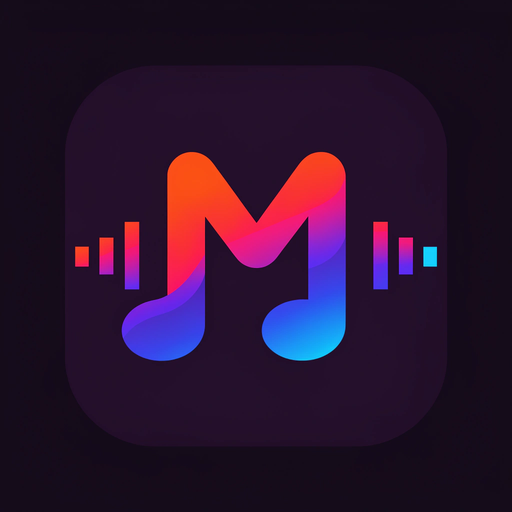

# Melodix



**Feel Every Note.**

A minimal, dark-first Material 3 YouTube Music client for Android with vibrant
accent colors, liquid-glass surfaces and Spotify personalization.

> ⚠️ Melodix is not affiliated with, funded, authorized, endorsed by, or in any
> way associated with YouTube, Google LLC, Spotify AB or Qobuz.

## Features

- Ad-free, background YouTube Music playback with offline downloads
- Spotify integration — library, search, home & recommendations (no Premium, no dev account)
- Experimental lossless (FLAC / Hi-Res) with silent YouTube fallback
- Synced, word-by-word lyrics from multiple providers, romanization & AI translation
- Liquid-glass navigation, toolbar & mini-player (OpenTune-style) with circular tab indicator
- Local file playback with folder filtering
- Listen Together sessions, music recognition, equalizer, crossfade, sleep timer & alarms
- Home-screen widgets, QS tile, Android Auto, Discord RPC, Last.fm scrobbling
- Wrapped-style year stats · haptic feedback system · theme presets
- 60+ languages inherited + Melodix strings in 10 languages

## Design

Near-black surfaces (`#0A0A0E`), violet `#7C4DFF` / cyan `#00E5FF` accents,
refractive liquid-glass chrome, expressive M3 cards, system typography.
The now-playing screen intentionally keeps the proven Meld player.

## Installation

- **GitHub Releases** (recommended): download the APK from Releases
- **IzzyOnDroid / Obtainium**: add `Cosm1cBug/melodix`
- **F-Droid**: metadata ships in `fastlane/`

## Building

See [BUILDING.md](BUILDING.md). Quick version:

```bash
git clone https://github.com/Cosm1cBug/melodix.git && cd melodix
./gradlew assembleFossDebug
```

## Credits & upstream model

Melodix stands on the shoulders of the open-source YTM-client family:

- [**InnerTune**](https://github.com/z-huang/InnerTune) — the original foundation (Zion Huang, Malopieds)
- [**OuterTune**](https://github.com/OuterTune/OuterTune) — local playback & lyrics heritage (DD3Boh, mikooomich)
- [**Metrolist**](https://github.com/MetrolistGroup/Metrolist) — design language & UX (Mo Agamy)
- [**Meld**](https://github.com/FrancescoGrazioso/Meld) — the direct base: Spotify layer, lossless, glass mini-player (Francesco Grazioso)
- [**OpenTune**](https://github.com/Arturo254/OpenTune) — liquid-glass UX model, folder filtering, settings inspiration (Arturo254)

Libraries: androidx Media3, Jetpack Compose & Material 3, Hilt, Room, ktor,
Coil, materialKolor, haze & kyant backdrop (liquid glass), Kizzy (Discord RPC),
BetterLyrics, LrcLib, KuGou, SimpMusic, Paxsenix, MusicRecognizer, metroserver
(Listen Together), protobuf, kuromoji/tinypinyin.

Full legal attribution: [NOTICE.md](NOTICE.md). Maintainer docs:
[MAINTAINERS_GUIDE.md](MAINTAINERS_GUIDE.md).

## License

**GPL-3.0** — see [LICENSE](LICENSE).
